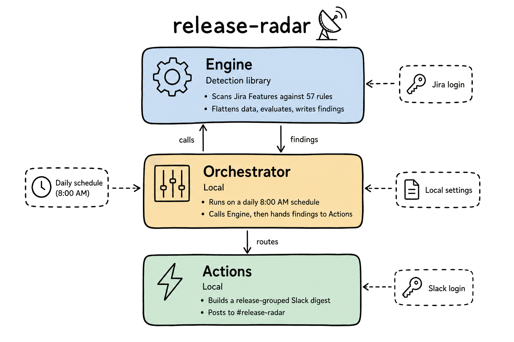

# release-radar

A system for detecting and acting on Jira policy violations across
field-hygiene and release-lifecycle rules. The engine evaluates issues
against a library of YAML rules and outputs structured violations with full
provenance (rule ID, enforcement level, source references).

Built for RHOAI teams on `redhat.atlassian.net`. Defaults target the
Data Processing team but any team can override via CLI flags.



Layer deep-dives: [Engine](design/engine-component-design.png) ·
[Orchestrator](design/orchestrator-component-design.png) ·
[Actions](design/actions-component-design.png)

## System layers

release-radar has three layers: the **Engine** (this repo), the
**Orchestrator**, and **Actions**.

The Engine is what you're looking at. It's a standalone CLI tool that
provides immediate value on its own: point it at your team's Jira
issues, get back a structured report of every policy violation with
rule IDs, severity, and source references. No orchestration needed,
no setup beyond credentials. One command, full visibility.

What you *do* about those violations is a separate concern, handled by
the Orchestrator and Actions layers.

**The Orchestrator and Actions are local.** This is intentional. How a
team responds to findings is a matter of preference: which Slack channel
to post to, whether to DM individuals or summarize for leads, what
thresholds warrant escalation, whether to run daily or on-demand. These
are opinions, not universal truths. Teams should have autonomy over how
they act on findings.

The engine is published and ready to use today. The full system
(orchestration + actions) may be adopted by the extended team as
patterns mature.

| Layer | What it does | Where it lives |
|---|---|---|
| **Engine** | Fetch, normalize, evaluate, output violations | This repo |
| **Orchestrator** | Configure scan parameters, route findings | Local |
| **Actions** | Post to dedicated Slack channel, tag owners | Local |

## Quick start

```bash
# Clone and install
git clone https://github.com/cabynum/release-radar.git
cd release-radar
python3 -m venv .venv && source .venv/bin/activate
pip install -e ".[dev]"

# Set credentials
cp .env.example .env
# Edit .env with your Jira email and API token

# Run against live Jira (defaults to Data Processing team)
python3 -m engine.run --releases 3.5,3.6

# Target a different team
python3 -m engine.run --releases 3.5,3.6 --component "Model Serving"
python3 -m engine.run --releases 3.5,3.6 --projects RHAISTRAT,RHOAIENG

# Run against a saved snapshot (no network needed)
python3 -m engine.run --snapshot output/snapshot.json
```

## Team configuration

By default, the engine targets the Data Processing team across three
Jira projects:

| Flag | Default | Description |
|---|---|---|
| `--component` | `Data Processing` | Jira component to filter on |
| `--projects` | `RHAISTRAT,RHAIENG,RHOAIENG` | Comma-separated Jira project keys |
| `--releases` | `3.5,3.6` | Comma-separated release versions |

Override any flag to target your team's issues. The rules themselves are
org-wide RHOAI policy and apply to all teams.

## Rules

Rules are YAML files in `rules/`. Each rule specifies:

- `applies_to` - issue types it checks
- `trigger` (optional) - milestone-based activation window
- `condition` - AND-gated field checks that must all pass for a violation
- `action` - what to report (message template, recipients)
- `sources` - provenance (SOURCE-XX references to process docs)

### Field hygiene

Data correctness checks that run on every evaluation. Missing required
fields, data integrity, staleness, hierarchy violations, cross-system
checks (sign-off completeness, doc links, PR compliance).

### Release lifecycle

Org-policy checks that activate within milestone windows. Feature freeze
readiness, code freeze enforcement, sign-off gates, exception processes,
quality gates.

## Tests

```bash
pytest
```

Unit tests covering condition operators, normalization, changelog
parsing, and milestone trigger logic.

## Configuration

### Required

- `JIRA_EMAIL` - Jira account email
- `JIRA_API_TOKEN` - Jira API token

### Optional

- `gh` CLI authenticated (for GitHub PR inspection post-code-freeze)

## Milestones

`milestones.yaml` defines release schedules. Release-lifecycle rules
use these dates to determine when their trigger windows are active.
Update this file when new releases are planned.
