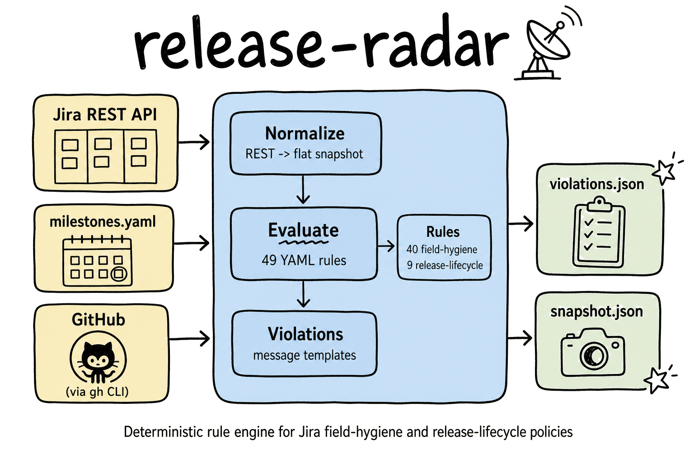

# release-radar

A rule engine that evaluates Jira issues against field-hygiene and
release-lifecycle policies. Outputs structured violations with full
provenance (rule ID, enforcement level, source references).

Built for RHOAI teams on `redhat.atlassian.net`. Defaults target the
Data Processing team but any team can override via CLI flags.



## What it does

- Fetches issues from Jira REST API (with changelog for staleness detection)
- Normalizes raw API responses into a flat snapshot format
- Evaluates 57 YAML rules (41 field-hygiene + 16 release-lifecycle)
- Some rules check external sources (GitHub PRs, Jira subtask sign-offs)
- Outputs `violations.json` with per-issue findings

## Quick start

```bash
# Clone and install
git clone https://github.com/cabynum/release-radar.git
cd release-radar
python3 -m venv .venv && source .venv/bin/activate
pip install -e ".[dev]"

# Set credentials
cp .env.example .env
# Edit .env with your Jira email and API token

# Run against live Jira (defaults to Data Processing team)
python3 -m engine.run --releases 3.5,3.6

# Target a different team
python3 -m engine.run --releases 3.5,3.6 --component "Model Serving"
python3 -m engine.run --releases 3.5,3.6 --projects RHAISTRAT,RHOAIENG

# Run against a saved snapshot (no network needed)
python3 -m engine.run --snapshot output/snapshot.json
```

## Team configuration

By default, the engine targets the Data Processing team across three
Jira projects:

| Flag | Default | Description |
|---|---|---|
| `--component` | `Data Processing` | Jira component to filter on |
| `--projects` | `RHAISTRAT,RHAIENG,RHOAIENG` | Comma-separated Jira project keys |
| `--releases` | `3.5,3.6` | Comma-separated release versions |

Override any flag to target your team's issues. The rules themselves are
org-wide RHOAI policy and apply to all teams.

## Rules

Rules are YAML files in `rules/`. Each rule specifies:

- `applies_to` - issue types it checks
- `trigger` (optional) - milestone-based activation window
- `condition` - AND-gated field checks that must all pass for a violation
- `action` - what to report (message template, recipients)
- `sources` - provenance (SOURCE-XX references to process docs)

### Field hygiene (41 rules)

Data correctness checks that run on every evaluation. Missing required
fields, data integrity, staleness, hierarchy violations, cross-system
checks (sign-off completeness, doc links, PR compliance).

### Release lifecycle (16 rules)

Org-policy checks that activate within milestone windows. Feature freeze
readiness, code freeze enforcement, sign-off gates, exception processes,
quality gates.

## Architecture

```
engine/
  conditions.py   - condition operators (AND-gate evaluation)
  normalize.py    - Jira REST API -> flat snapshot
  evaluate.py     - rule loop orchestrator
  violations.py   - violation building + message templates
  milestones.py   - milestone loading + trigger windows
  jira_client.py  - Jira REST auth/fetch
  enrich.py       - external data resolution (GitHub, Jira subtasks)
  run.py          - CLI pipeline
```

## Tests

```bash
pytest
```

132 unit tests covering condition operators, normalization, changelog
parsing, and milestone trigger logic.

## Configuration

### Required

- `JIRA_EMAIL` - Jira account email
- `JIRA_API_TOKEN` - Jira API token

### Optional

- `gh` CLI authenticated (for GitHub PR inspection post-code-freeze)

## Milestones

`milestones.yaml` defines release schedules. Release-lifecycle rules
use these dates to determine when their trigger windows are active.
Update this file when new releases are planned.
