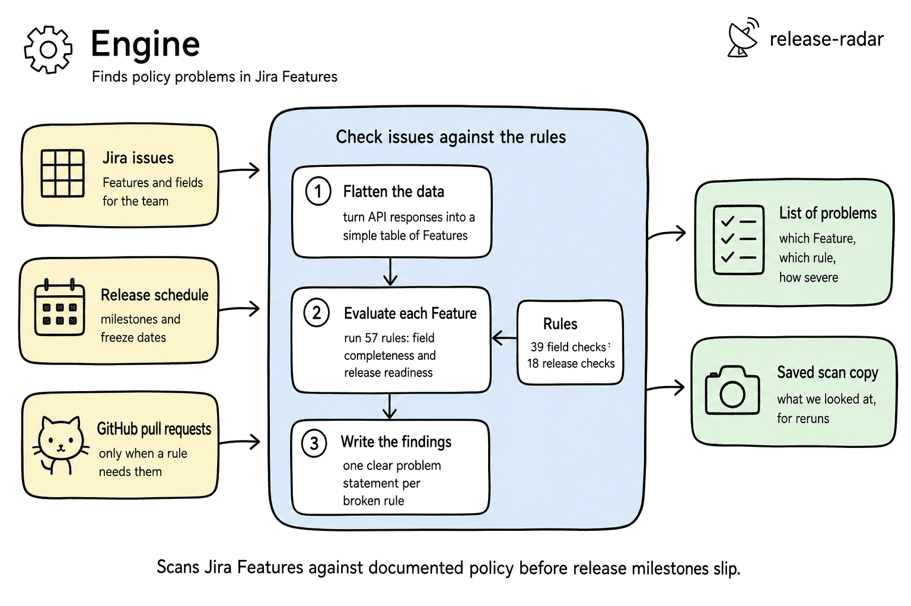

# Engine

Detection library for Jira field-hygiene and release-lifecycle policy
violations. Deterministic evaluation with structured output.



## What it does

- Fetches issues from Jira REST API (with changelog for staleness detection)
- Normalizes raw API responses into a flat snapshot format
- Evaluates 57 YAML rules (39 field-hygiene + 18 release-lifecycle)
- Some rules check external sources (GitHub PRs, Jira subtask sign-offs)
- Outputs `violations.json` with per-issue findings

## Modules

```
conditions.py   - condition operators (AND-gate evaluation)
normalize.py    - Jira REST API -> flat snapshot
evaluate.py     - rule loop orchestrator
violations.py   - violation building + message templates
milestones.py   - milestone loading + trigger windows
jira_client.py  - Jira REST auth/fetch
enrich.py       - external data resolution (GitHub, Jira subtasks)
run.py          - CLI pipeline
```

## Usage

```bash
# Run against live Jira
python3 -m engine.run --releases 3.5,3.6

# Target a different team
python3 -m engine.run --releases 3.5,3.6 --component "Model Serving"

# Run against a saved snapshot (no network needed)
python3 -m engine.run --snapshot output/snapshot.json
```

## Configuration

### Required

- `JIRA_EMAIL` - Jira account email
- `JIRA_API_TOKEN` - Jira API token

### Optional

- `gh` CLI authenticated (for GitHub PR inspection post-code-freeze)
